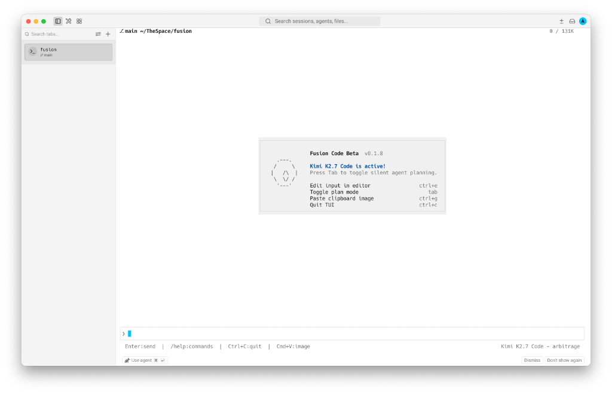
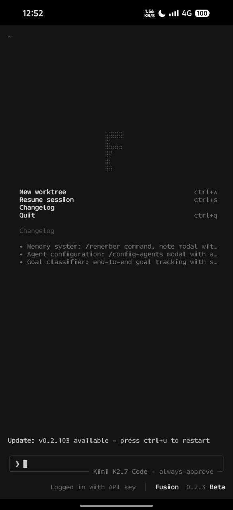

# Fusion

**Fusion** is a terminal-first AI coding agent — **made by Fusion AI**.

| Desktop | Mobile (Termux) |
|:---:|:---:|
|  |  |


## Install

```bash
curl -sSL https://raw.githubusercontent.com/theaungmyatmoe/fusion/main/scripts/install.sh | sh
```


## Usage

```bash
fusion login                    # sign in
fusion                          # interactive TUI
fusion --minimal                # scrollback-friendly mode
fusion -p "fix the bug"         # headless one-shot
fusion --always-approve -p "…"  # auto-approve all tools
```

> For configuration, build instructions, architecture details, and the full CLI reference see **[docs/DETAILS.md](docs/DETAILS.md)**.


## License

MIT OR Apache-2.0
